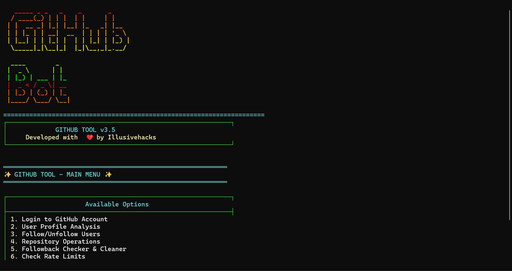
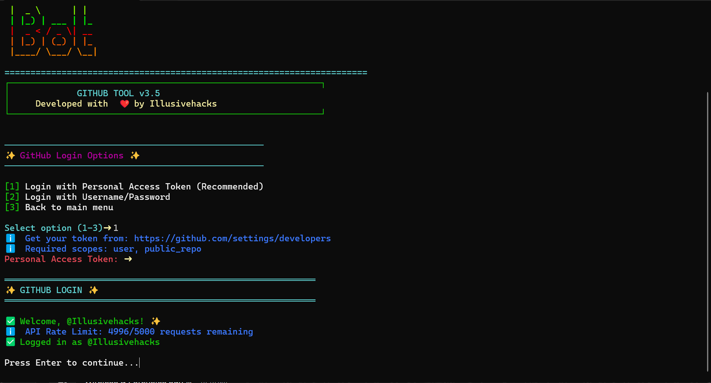
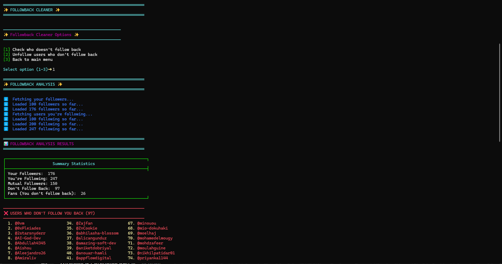

# GitHub Automation Tool (Mass Following and Unfollowing) v3.5 ⚡
Github Mass Following and Unfollowing script. This is for educational purposes only!!!.

# Installation

# Clone the repository
git clone https://github.com/Illusivehacks/Github_Mass_Following.git

cd Github_Mass_Following

ls 

# Install requirements
pip install -r requirements.txt

# Run the tool
python github_tool.py

# Login with Token
1. Get your GitHub token: https://github.com/settings/developers

2. Select option 1 from main menu

3. Choose "Login with Personal Access Token (Fine-grained tokens)"

4. Enter your token

# 🚀 Features
✅ Followback Analyzer
Smart Analysis: Find users who don't follow you back.
Bulk Unfollow: Remove non-followers in batches.
Safe Limits: Configurable delays to avoid rate limits.
Statistics: View follow-back ratios and mutual connections.

✅ Profile Analytics
User Stats: Followers, following, repositories, stars.
Language Breakdown: Top programming languages.
Account Metrics: Account age, hireability, social links.
Visual Display: Color-coded terminal output.

✅ Follow Management
Single/Bulk Follow: Follow individual users or multiple at once.
Smart Verification: Check user existence before following.
Session Tracking: Track all actions during your session.
Rate Limit Aware: Automatic API limit monitoring.

✅ Repository Operations
Star Repos: Single or bulk repository starring.
Repository Info: Detailed analytics for any repo.
Fork Support: Fork repositories to your account.
Language Stats: Repository language distribution.

# ⚠️ Important Warnings
Rate Limits
GitHub API: 5000 requests per hour (authenticated).
Search API: 30 requests per minute.
Tool Protection: Built-in delays and limit checking.

## Safety Guidelines
Max 50 unfollows per session recommended.
10-30 second delays between actions.
Check rate limits before bulk operations.
Use responsibly - avoid spam-like behavior.

## What NOT to Do
❌ Don't unfollow hundreds at once.

❌ Don't use minimal delays.

❌ Don't ignore rate limit warnings.

❌ Don't use for spam or harassment.

# ❓ FAQ
Q: Is this against GitHub ToS?
A: No, when used responsibly. The tool respects rate limits and is for legitimate account management.

Q: Can I get banned?
A: Only if you abuse the API. Follow the safety guidelines and use reasonable delays.

Q: How many users can I unfollow at once?
A: Start with 20-50, monitor results and adjust. Never do hundreds at once.

 Q: Does it work with private accounts?
A: It works with whatever your token permissions allow. Public repos and user info require appropriate scopes.

 Q: Can I automate following?
A: Yes, but use with caution. Always verify users exist and add delays.

# 🤝 Contributing
Fork the repository.

# 📄 License
MIT License - See LICENSE file for details.

# ⚠️ Disclaimer
This tool is for educational purposes. Use responsibly and in accordance with GitHub's Terms of Service. The developers are not responsible for any misuse.

# 👨 Author
Illusivehacks

GitHub: @Illusivehacks

Tool Version: 3.5

Last Updated: 2026

